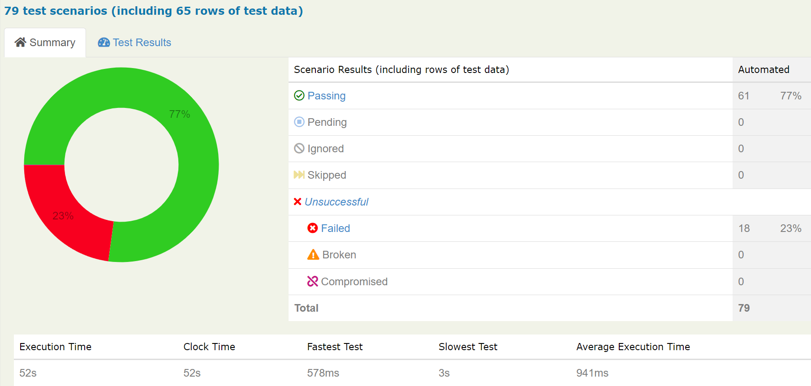
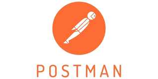

# GroupProject-QE10-Team1 Alterra Academy
### API manual and automation testing for web https://dummyjson.com/
#
### A. Project Description
    > Project Goal:
      The goal of this project is to create a comprehensive set of manual and automated tests for the 
      DummyJSON API. These tests will help to ensure that the API is working as expected.
  
    > Scope:
      The scope of this project includes a number of endpoints and resources exposed by the DummyJSON 
      API. This includes the following: Auth, Carts, Products, Users, and Quotes.
    
    > Test Planning:
      a. Analyze the API documentation for https://dummyjson.com/ to understand its endpoints, 
         parameters, and expected responses.
      b. Identify the key features and functionalities to be tested.
      c. Define test objectives, test scenarios, and test cases based on the API requirements.

    > Testing Phase:
      a. Manual testing
         Manual testing will be completed in the first phase. This will involve manually sending 
         requests to the API and verifying the responses.
   
      b. Automation testing
         Automated testing will be completed in the second phase. This will involve to create automated 
         tests that can be run against the API.

    > Documentation and Reporting:
      a. Document the test cases, test results, and any issues discovered during testing.
      b. Generate comprehensive reports summarizing the testing activities, results, and recommendations 
         for improvements.

### B. Manual Test Case Link
    > Spreadsheet   : https://docs.google.com/spreadsheets/d/1ZO0K83aS5IDuCzMh9OxKTRl6TTh5i3ju0M0LN4XXrt4/edit?usp=share_link
    > Postman       : https://bold-firefly-997052.postman.co/workspace/Group-Project~88a786de-2803-4960-acd9-45fdb9f3d817/collection/25701303-6c554419-b5be-48ee-98f3-9aa3091fe23b?action=share&creator=25701303

### C. Overall Test Report Image

### D. Image Coverage of Each Feature

### E. Tools & Technology Stack

### F. How To Run Project
    > Manual Testing using Postman:
      a. Add new request
      b. Choose method
      c. Input url
      d. Input body (if needed)
      e. Click send

    > Automation Testing:
      a. Click on text editor's terminal
      b. input => mvn clean verify

### G. Team Member
    > Muhammad Faruqi Rabbani    =>  Auth & Carts
    > Arum Puspa Khinanthi       =>  Users
    > Andersen Sebastian Gunawan =>  Products
    > Adella Rifiandika Putri    =>  Quotes